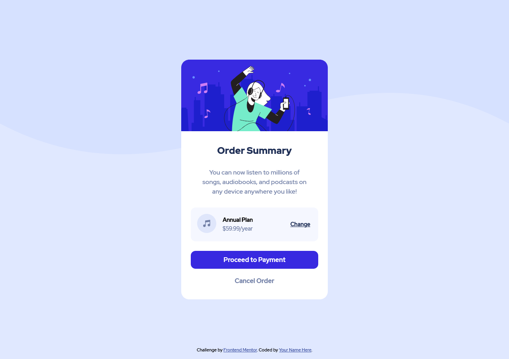

# Frontend Mentor - Order summary card solution

This is a solution to the [Order summary card challenge on Frontend Mentor](https://www.frontendmentor.io/challenges/order-summary-component-QlPmajDUj). Frontend Mentor challenges help you improve your coding skills by building realistic projects. 

## Table of contents

- [Frontend Mentor - Order summary card solution](#frontend-mentor---order-summary-card-solution)
  - [Table of contents](#table-of-contents)
  - [Overview](#overview)
    - [The challenge](#the-challenge)
    - [Screenshot](#screenshot)
    - [Links](#links)
  - [My process](#my-process)
    - [Built with](#built-with)
    - [What I learned](#what-i-learned)

## Overview

### The challenge

Users should be able to:

- Access the order summary on a variety of screens
- See hover states for interactive elements

### Screenshot

### Links

- Github Pages URL: [[Add live site URL here](https://geebru.github.io/fem-order-summary/)](https://geebru.github.io/fem-order-summary/)

## My process

### Built with

- Semantic HTML5 markup
- CSS custom properties
- CSS logical prop
- Flexbox
- Mobile-first responsive styling

### What I learned

This was primarily a test for myself to use logical properties on a small project. Originally I thought browser support for them was low, but recent readings led me to see that a majority _are_ supported.

Safari does have limited support for logical border properties but those weren't in use for this project.

It was a good test bed for getting into the mental rhythm of using inline/block over cardinal directions.
